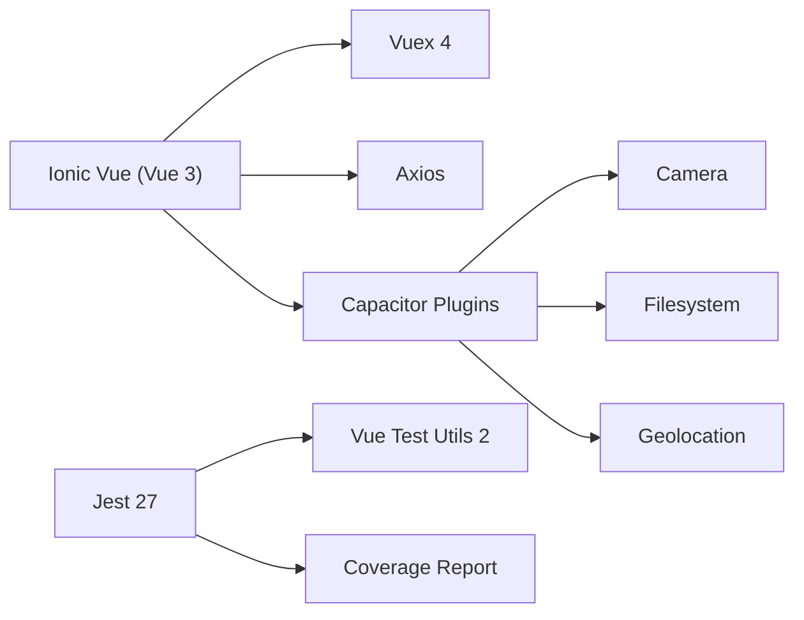
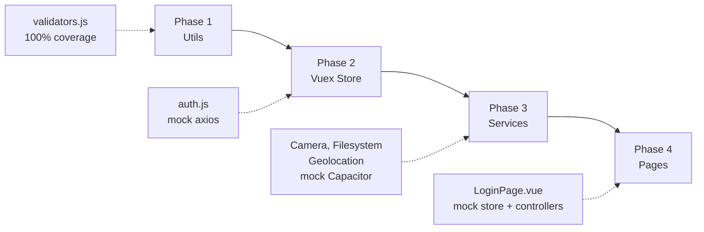
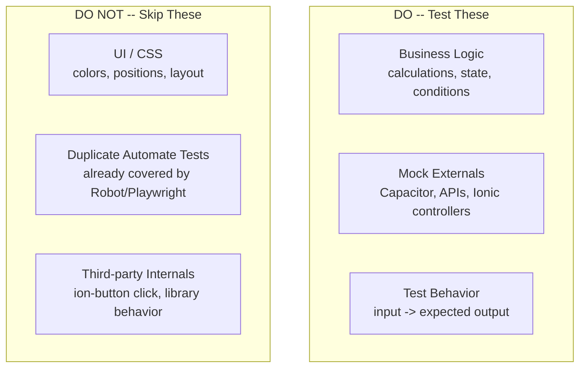
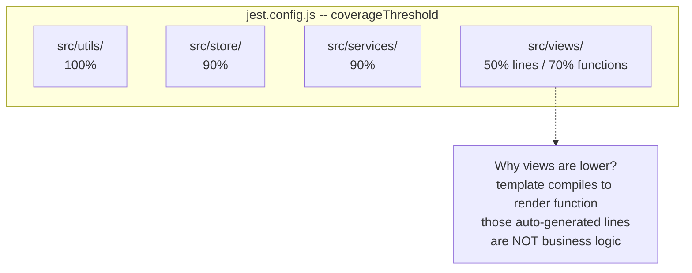
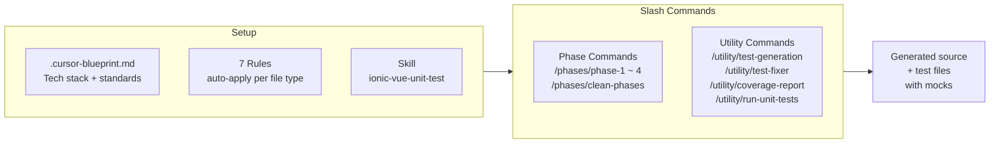
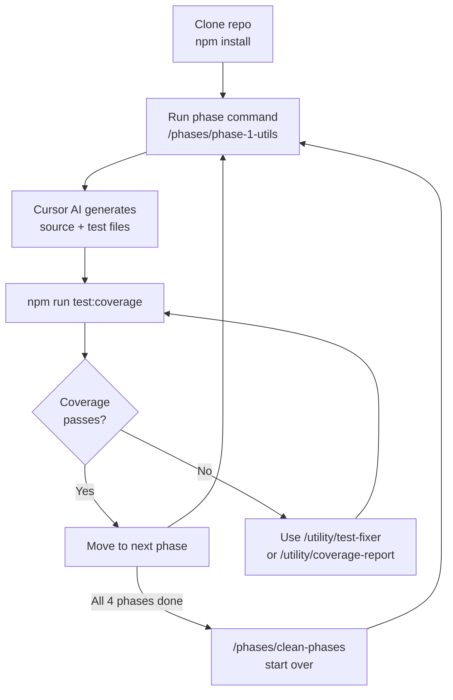
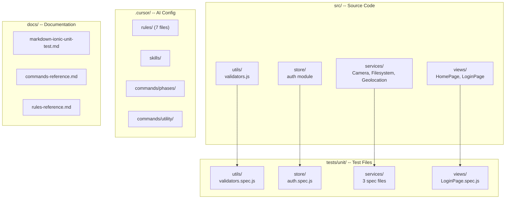

# Ionic Vue Unit Test Repository -- Overview

---

## What is this repo?

A **learning template** for dev teams to practice writing unit tests in Ionic Vue projects using Jest, Vue Test Utils, and Cursor AI.

---

## Tech Stack

---

## Learning Phases

| Phase | What you learn | Coverage target |
| --- | --- | --- |
| 1. Utils | Pure function testing, edge cases | 100% |
| 2. Store | Vuex mutations/actions, mocking Axios | 90% |
| 3. Services | Mocking Capacitor plugins, async | 90% |
| 4. Pages | Component mount, mock store, Ionic controllers | 50-70% |

---

## Testing Strategy

---

## Coverage Strategy

**Key principle:** Measure logic quality, not line count.

- `<script>` = business logic (test this)
- `<template>` = compiled render function (inflates coverage, low value)
- `<style>` = stripped by vue3-jest (not counted)

---

## How Cursor AI Helps

---

## Developer Workflow

---

## Repository Structure

---

## Quick Start Commands

| Action | Command |
| --- | --- |
| Install | `npm install` |
| Dev server | `npm run serve` |
| Run tests | `npm run test:jest` |
| Run with coverage | `npm run test:coverage` |
| Open coverage report | `npm run test:coverage:open` |
| Lint | `npm run lint` |

---

## Summary

1. **Focus on Logic** -- test calculations, state, conditions; skip UI/CSS
2. **Mock Everything External** -- Capacitor, APIs, Ionic controllers
3. **Per-directory Thresholds** -- 100% utils, 90% store/services, 50-70% views
4. **Cursor AI Accelerates** -- rules + commands + skills auto-generate boilerplate
5. **Repeatable Practice** -- clean and regenerate phases anytime
