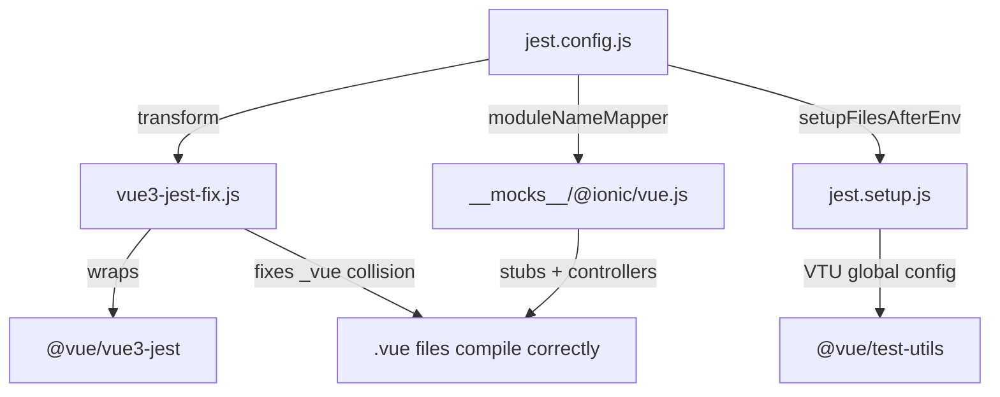

# Setup Guide: เพิ่ม Jest Unit Testing ให้โปรเจกต์ Ionic Vue ที่มีอยู่แล้ว

คู่มือนี้สำหรับโปรเจกต์ Ionic Vue ที่มีอยู่แล้วแต่ยังไม่มี Unit Test — ทำตามทีละขั้นตอนเพื่อติดตั้ง Jest, Mock Architecture, และ Cursor AI commands/rules สำหรับช่วยเขียนเทส

---

## Quick Checklist

คัดลอกไฟล์จาก `ionic-unit-test` repository:

**Core (ต้องมี — เทสจะไม่ทำงานถ้าขาด):**
- [ ] `vue3-jest-fix.js` → project root
- [ ] `__mocks__/@ionic/vue.js` → project root
- [ ] `jest.setup.js` → project root
- [ ] `jest.config.js` → project root (ปรับ config ตามโปรเจกต์)

**Cursor AI (แนะนำ — ช่วยให้ AI เขียนเทสถูกมาตรฐาน):**
- [ ] `.cursor/rules/` (7 files) → copy ทั้งโฟลเดอร์
- [ ] `.cursor/commands/utility/` (5 files) → copy ทั้งโฟลเดอร์
- [ ] `.cursorignore` → project root

**Reference Docs (อ้างอิง):**
- [ ] `docs/commands-reference.md` → อธิบายแต่ละ command
- [ ] `docs/rules-reference.md` → อธิบายแต่ละ rule

---

## Architecture Diagram

ไฟล์ทั้ง 4 ตัวเชื่อมต่อกันผ่าน `jest.config.js`:



---

## Step 1: Install Dev Dependencies

รันคำสั่งนี้ในโปรเจกต์ที่ต้องการเพิ่ม Unit Test:

```bash
npm install --save-dev \
  jest@^27 \
  jest-environment-jsdom@^27 \
  @vue/test-utils@^2 \
  @vue/vue3-jest@^27 \
  @vue/compiler-sfc@^3 \
  babel-jest@^27 \
  @babel/core@^7 \
  @babel/preset-env@^7
```

### ตรวจสอบ `babel.config.js`

โปรเจกต์ Ionic Vue ส่วนใหญ่มีไฟล์นี้อยู่แล้วจาก Vue CLI — ตรวจสอบว่ามี `@babel/preset-env`:

```javascript
// babel.config.js — ถ้ามีอยู่แล้วไม่ต้องแก้ แค่เช็กว่ามี preset-env
module.exports = {
  presets: ['@babel/preset-env'],
};
```

ถ้ายังไม่มีไฟล์นี้ ให้สร้างใหม่ตามด้านบน

### เพิ่ม npm scripts

เพิ่มใน `package.json` > `scripts`:

```json
{
  "scripts": {
    "test": "npx jest --verbose --coverage; open coverage/lcov-report/index.html",
    "test:jest": "npx jest",
    "test:coverage": "npx jest --coverage"
  }
}
```

| Script | ทำอะไร |
| --- | --- |
| `npm run test` | รันเทส + แสดง coverage + เปิด HTML report อัตโนมัติ |
| `npm run test:jest` | รันเทสแบบเร็ว (ไม่มี coverage) |
| `npm run test:coverage` | รันเทส + แสดง coverage table (ไม่เปิด report) |

> **หมายเหตุ:** ใช้ `npx jest` แทน `vue-cli-service test:unit` เพราะ vue-cli-service อาจ override `transform` setting ทำให้ `vue3-jest-fix.js` ไม่ถูกใช้

---

## Step 2: Copy Core Mock Files (3 files)

คัดลอก 3 ไฟล์นี้จาก `ionic-unit-test` repo ไปวางที่ **project root** โดยไม่ต้องแก้ไขอะไร:

### 2a. `vue3-jest-fix.js` (Custom Transform Wrapper)

**ทำหน้าที่:** แก้บั๊กของ `@vue/vue3-jest` ที่คอมไพล์ `<script>` และ `<template>` แล้วสร้างตัวแปร `var _vue = require(...)` ซ้ำกัน ทำให้ controllers กลายเป็น `undefined`

**ถ้าไม่มีไฟล์นี้:** `loadingController`, `toastController`, `modalController`, `alertController` จะเป็น `undefined` ในทุก `.vue` file — เทสที่เรียก controller จะพังทั้งหมด

```javascript
// vue3-jest-fix.js — copy ไปวางที่ project root ไม่ต้องแก้ไข
const vue3Jest = require('@vue/vue3-jest');

module.exports = {
  process(src, filename, options) {
    const result = vue3Jest.process(src, filename, options);
    let code = typeof result === 'string' ? result : result.code;
    if (!filename.endsWith('.vue')) return result;

    const marker = '"use strict";';
    const firstIdx = code.indexOf(marker);
    if (firstIdx === -1) return result;
    const secondIdx = code.indexOf(marker, firstIdx + marker.length);
    if (secondIdx === -1) return result;

    // เปลี่ยนชื่อ _vue → _vue2 เฉพาะส่วน render function เพื่อไม่ให้ชนกัน
    const scriptSection = code.slice(0, secondIdx);
    const renderSection = code.slice(secondIdx).replace(/\b_vue\b/g, '_vue2');
    code = scriptSection + renderSection;

    if (typeof result === 'string') return code;
    return { ...result, code };
  },
};
```

### 2b. `__mocks__/@ionic/vue.js` (Manual Mock)

**ทำหน้าที่:** Mock กลางสำหรับ `@ionic/vue` ทั้งหมด

- **Component stubs** — render เป็น HTML tag จริง (`<ion-input>`, `<ion-button>` ฯลฯ) ทำให้ `find('ion-input')` ใช้งานได้
- **Controller mocks** — `loadingController`, `toastController`, `modalController`, `alertController` เป็น `jest.fn()`
- **Proxy fallback** — component `Ion*` ตัวไหนที่ไม่ได้ list ไว้จะถูกสร้าง stub อัตโนมัติ

**ถ้าไม่มีไฟล์นี้:** Jest จะพยายาม parse `@ionic/vue` แบบ ESM แล้วพัง (`SyntaxError: Cannot use import statement outside a module`)

**วิธี copy:** สร้างโฟลเดอร์ `__mocks__/@ionic/` ที่ root แล้ววาง `vue.js` ลงไป

```bash
mkdir -p __mocks__/@ionic
cp <ionic-unit-test>/__mocks__/@ionic/vue.js __mocks__/@ionic/vue.js
```

### 2c. `jest.setup.js` (Global Config)

**ทำหน้าที่:** ตั้งค่า Vue Test Utils global plugin + suppress warning

**ถ้าไม่มีไฟล์นี้:** จะเจอ warning `Invalid vnode type: undefined` จำนวนมาก

```javascript
// jest.setup.js — copy ไปวางที่ project root ไม่ต้องแก้ไข
import { config } from '@vue/test-utils';

const IonicVueStub = { install: () => {} };
config.global.plugins = [IonicVueStub];

const originalWarn = console.warn;
console.warn = function (msg, ...args) {
  if (typeof msg === 'string' && msg.includes('Invalid vnode type')) return;
  originalWarn.apply(console, [msg, ...args]);
};
```

> **Warning:** ห้ามลบ `vue3-jest-fix.js` และ `__mocks__/@ionic/vue.js` — ทั้งสองไฟล์ทำงานคู่กัน ถ้าขาดตัวใดตัวหนึ่ง unit test ที่ใช้ Ionic controller จะพังทันที

---

## Step 3: Create `jest.config.js`

สร้างไฟล์ `jest.config.js` ที่ project root:

```javascript
module.exports = {
  testEnvironment: 'jsdom',
  setupFilesAfterEnv: ['<rootDir>/jest.setup.js'],
  moduleFileExtensions: ['js', 'jsx', 'json', 'vue'],

  // ──────────────────────────────────────────────────────────────
  // ห้ามแก้ 3 setting นี้ — ถ้าแก้ controller mocks จะพัง
  // ──────────────────────────────────────────────────────────────
  transform: {
    '^.+\\.vue$': '<rootDir>/vue3-jest-fix.js',   // ใช้ wrapper แทน @vue/vue3-jest ตรงๆ
    '^.+\\.m?js$': 'babel-jest',
  },
  moduleNameMapper: {
    '^@/(.*)$': '<rootDir>/src/$1',
    '^@ionic/vue$': '<rootDir>/__mocks__/@ionic/vue.js',  // ชี้ไป manual mock
  },

  // ──────────────────────────────────────────────────────────────
  // ปรับตามโปรเจกต์ของคุณ
  // ──────────────────────────────────────────────────────────────
  testMatch: [
    '**/tests/unit/**/*.spec.[jt]s?(x)',
    '**/__tests__/**/*.[jt]s?(x)',
  ],
  collectCoverageFrom: [
    'src/**/*.{vue,js}',
    '!src/main.js',
    '!src/router/**',       // ปรับ: exclude ไฟล์ที่ไม่ต้องเทส
    '!**/node_modules/**',
  ],

  // ปรับ directory และ % ตามโปรเจกต์
  coverageThreshold: {
    'src/utils/': {
      branches: 100, functions: 100, lines: 100, statements: 100,
    },
    'src/store/': {
      branches: 90, functions: 90, lines: 90, statements: 90,
    },
    'src/services/': {
      branches: 90, functions: 90, lines: 90, statements: 90,
    },
    'src/views/': {
      branches: 50, functions: 70, lines: 50, statements: 50,
    },
  },
};
```

### Setting ที่ต้องปรับตามโปรเจกต์

| Setting | ปรับอะไร |
| --- | --- |
| `moduleNameMapper` > `'^@/(.*)$'` | ถ้าใช้ path alias อื่น (เช่น `~`) ให้เปลี่ยนตาม |
| `testMatch` | ถ้าเก็บ test ที่อื่น (เช่น `src/**/*.spec.js`) ให้เปลี่ยนตาม |
| `collectCoverageFrom` | เพิ่ม exclude สำหรับไฟล์ที่ไม่ต้อง coverage (เช่น `!src/plugins/**`) |
| `coverageThreshold` | เปลี่ยน directory names และ % ให้ตรงกับ folder structure ของโปรเจกต์ หรือลบออกถ้ายังไม่ต้องการ threshold |

---

## Step 4: Copy Cursor AI Files

### 4a. Cursor Rules (7 files)

Copy โฟลเดอร์ `.cursor/rules/` ทั้งหมดไปวางในโปรเจกต์:

```bash
mkdir -p .cursor/rules
cp <ionic-unit-test>/.cursor/rules/*.mdc .cursor/rules/
```

Rules จะถูกใช้อัตโนมัติเมื่อเปิดไฟล์ที่ตรงกับ glob pattern:

| Rule | ทำอะไร | ใช้เมื่อเปิดไฟล์ |
| --- | --- | --- |
| `ionic-vue-project.mdc` | กำหนด tech stack + มาตรฐานให้ AI รู้จัก | **ทุกไฟล์** (always on) |
| `ionic-vue-testing.mdc` | mount strategy, mock architecture, element selection | `*.spec.js`, `tests/**` |
| `ionic-vue-jest.mdc` | Jest how-to: async, mock reset pattern | `tests/unit/**/*.spec.js` |
| `vuex-testing.mdc` | Pattern สำหรับเทส Vuex mutations/actions | `store/**/*.js`, `*store*.spec.js` |
| `test-generation.mdc` | สร้างเทสใหม่: factory, happy/edge, no data-testid | `src/components/**/*.vue`, `src/views/**/*.vue` |
| `test-fixer.mdc` | Debug และแก้เทสที่พัง | `*.spec.js` |
| `coverage-report.mdc` | วิเคราะห์ว่าทำไม coverage ต่ำ | `tests/unit/**/*.spec.js` |

### 4b. Cursor Utility Commands (5 files)

Copy โฟลเดอร์ `.cursor/commands/utility/` ไปวางในโปรเจกต์:

```bash
mkdir -p .cursor/commands/utility
cp <ionic-unit-test>/.cursor/commands/utility/*.md .cursor/commands/utility/
```

ใช้โดยพิมพ์ `/` ใน Cursor Chat:

| Command | ทำอะไร |
| --- | --- |
| `/utility/test-generation` | สร้าง test file ใหม่สำหรับ component ที่เปิดอยู่ |
| `/utility/ionic-vue-jest` | ใช้มาตรฐาน Ionic Vue Jest กับ test file ปัจจุบัน |
| `/utility/run-unit-tests` | รันเทส + ดู coverage |
| `/utility/test-fixer` | วิเคราะห์และแก้เทสที่พัง |
| `/utility/coverage-report` | วิเคราะห์ว่าทำไม coverage ต่ำ |

### 4c. `.cursorignore`

Copy `.cursorignore` ไปวาง project root เพื่อให้ Cursor ข้าม indexing ไฟล์ที่ไม่จำเป็น:

```
node_modules/
dist/
dist-ssr/
coverage/
package-lock.json
*.log
.cache/
.eslintcache
```

### 4d. Reference Docs (2 files)

Copy 2 ไฟล์นี้ไปไว้ที่ `docs/` ของโปรเจกต์:

```bash
mkdir -p docs
cp <ionic-unit-test>/docs/commands-reference.md docs/
cp <ionic-unit-test>/docs/rules-reference.md docs/
```

| File | เนื้อหา |
| --- | --- |
| `docs/commands-reference.md` | อธิบายรายละเอียดทุก Cursor command — ทำอะไร, ใช้เมื่อไหร่ |
| `docs/rules-reference.md` | อธิบายรายละเอียดทุก Cursor rule — กำหนดอะไร, trigger เมื่อไหร่ |

---

## Step 5: Verify Setup

สร้าง smoke test เพื่อตรวจสอบว่าทุกอย่างทำงาน:

```bash
mkdir -p tests/unit
```

สร้างไฟล์ `tests/unit/example.spec.js`:

```javascript
import { mount } from '@vue/test-utils';
import { loadingController, toastController } from '@ionic/vue';

describe('Setup verification', () => {
  it('Jest runs successfully', () => {
    expect(true).toBe(true);
  });

  it('Ionic controller mock is available', () => {
    expect(loadingController.create).toBeDefined();
    expect(typeof loadingController.create).toBe('function');
  });

  it('Controller mock returns present/dismiss', async () => {
    const loading = await loadingController.create({ message: 'test' });
    expect(loading.present).toBeDefined();
    expect(loading.dismiss).toBeDefined();
  });
});
```

รันเทส:

```bash
npx jest --verbose
```

**ผลลัพธ์ที่คาดหวัง:**

```
 PASS  tests/unit/example.spec.js
  Setup verification
    ✓ Jest runs successfully
    ✓ Ionic controller mock is available
    ✓ Controller mock returns present/dismiss

Test Suites: 1 passed, 1 total
Tests:       3 passed, 3 total
```

ถ้าผ่านทั้ง 3 ตัว — setup เสร็จสมบูรณ์ พร้อมเขียน Unit Test

---

## Troubleshooting

### `SyntaxError: Cannot use import statement outside a module`

**สาเหตุ:** `moduleNameMapper` ไม่ได้ชี้ `@ionic/vue` ไปที่ mock file

**แก้:** ตรวจสอบ `jest.config.js`:
```javascript
moduleNameMapper: {
  '^@ionic/vue$': '<rootDir>/__mocks__/@ionic/vue.js',
}
```

### `TypeError: Cannot read properties of undefined (reading 'create')`

**สาเหตุ:** `vue3-jest-fix.js` ไม่ถูกใช้เป็น transform — ตัวแปร `_vue` ชนกัน

**แก้:** ตรวจสอบ `jest.config.js`:
```javascript
transform: {
  '^.+\\.vue$': '<rootDir>/vue3-jest-fix.js',  // ต้องชี้ไปที่ wrapper ไม่ใช่ @vue/vue3-jest
}
```

### IDE แสดง Error สีแดง แต่ Terminal ผ่าน

**สาเหตุ:** IDE Jest extension อาจใช้ `vue-cli-service test:unit` ซึ่ง override transform setting

**แก้:** เพิ่มใน `.vscode/settings.json` (หรือ Cursor settings):
```json
{
  "jest.jestCommandLine": "npx jest"
}
```

### `Coverage data for src/xxx/ was not found`

**สาเหตุ:** `coverageThreshold` มี directory ที่ไม่มีไฟล์ source

**แก้:** ปรับ directory names ใน `coverageThreshold` ให้ตรงกับ folder structure ของโปรเจกต์ หรือลบ threshold ของ directory ที่ยังไม่มีไฟล์ออก

### Warning: `Invalid vnode type: undefined` จำนวนมาก

**สาเหตุ:** ไม่ได้ใช้ `jest.setup.js`

**แก้:** ตรวจสอบว่า `jest.config.js` มี:
```javascript
setupFilesAfterEnv: ['<rootDir>/jest.setup.js'],
```

---

## สรุปโครงสร้างไฟล์หลัง Setup

```
your-ionic-project/
├── __mocks__/
│   └── @ionic/
│       └── vue.js                     # Manual mock (stubs + controllers)
├── .cursor/
│   ├── rules/                         # 7 auto-applied rules
│   │   ├── ionic-vue-project.mdc
│   │   ├── ionic-vue-testing.mdc
│   │   ├── ionic-vue-jest.mdc
│   │   ├── vuex-testing.mdc
│   │   ├── test-generation.mdc
│   │   ├── test-fixer.mdc
│   │   └── coverage-report.mdc
│   └── commands/
│       └── utility/                   # 5 slash commands
│           ├── test-generation.md
│           ├── ionic-vue-jest.md
│           ├── run-unit-tests.md
│           ├── test-fixer.md
│           └── coverage-report.md
├── docs/
│   ├── commands-reference.md          # Reference: ทุก command
│   └── rules-reference.md            # Reference: ทุก rule
├── tests/
│   └── unit/
│       └── example.spec.js            # Smoke test (verify setup)
├── vue3-jest-fix.js                   # Transform wrapper (fixes collision)
├── jest.setup.js                      # VTU global config
├── jest.config.js                     # Jest config (customize per project)
├── babel.config.js                    # ต้องมี @babel/preset-env
├── .cursorignore                      # Skip indexing
└── ... (existing project files)
```
